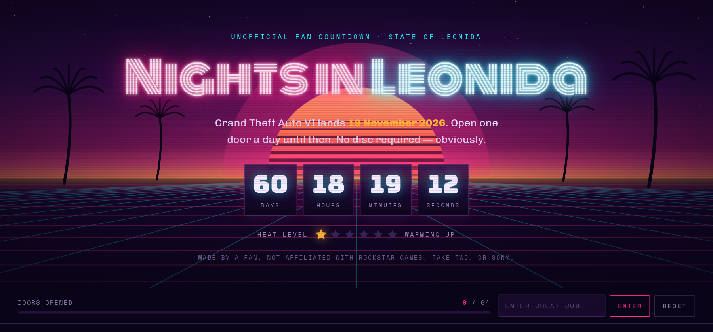
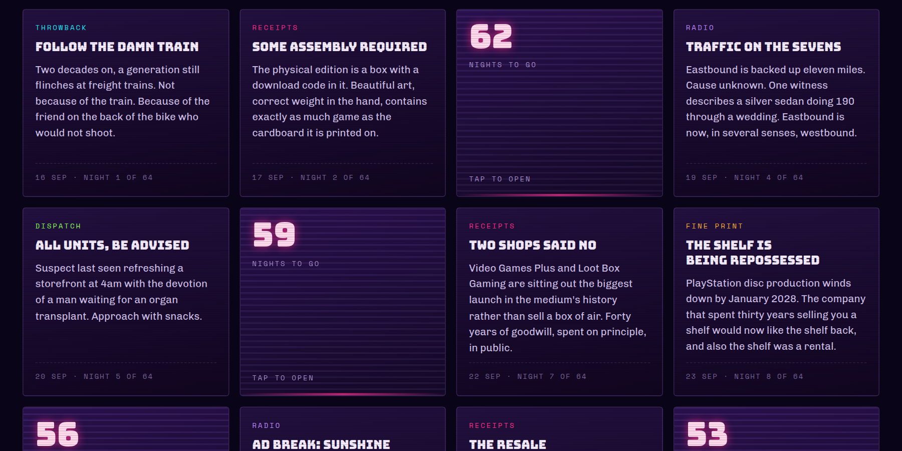

# Nights in Leonida

A 64-night neon advent countdown to Grand Theft Auto VI, with a working cheat
code and a running commentary on the disc that isn't in the box.

[](../../actions/workflows/ci.yml)
[](../../actions/workflows/pages.yml)



One door opens per night from 16 September to 18 November 2026, then launch
night. Each card is a throwback to a previous game, an in-world radio spot,
police scanner chatter, or a note on how "buying" a game stopped meaning
owning one.



## What it is

A single static HTML file. No framework, no build step, no dependencies at
runtime, no backend, no analytics, no cookies, and **no external requests** —
the fonts are self-hosted, so nothing phones home and there is nothing to
block. Total payload is around 600 KB, most of which is the social card.

- **Animated canvas hero** — synthwave sunset, slitted sun, moving perspective
  grid, palm silhouettes, CRT scanlines, flickering neon sign.
- **Live countdown** to 19 November 2026, plus a six-star heat meter that
  climbs as launch closes in.
- **64 doors** that roll open like garage shutters. A door unlocks on its own
  calendar date; tapping a locked one shakes it and throws a mock
  *"licence not yet validated"* error, which is the joke.
- **Cheat code: `NODISCNOPEACE`** — type it anywhere on the page, old-school,
  no input box needed. Unlocks everything at once, with no account check and
  no server in another country. That is also the entire access-control system.
- Respects `prefers-reduced-motion`; the canvas renders one static frame.

## Run it locally

No install needed — it's one HTML file:

```bash
open index.html      # macOS.  Linux: xdg-open  ·  Windows: start
```

Or serve it, which is closer to production:

```bash
npm run serve        # http://localhost:4173
```

Run the checks before you push anything:

```bash
npm test
```

That verifies the card array is exactly 64 long, the categories are all known,
the dates haven't drifted, nothing external is being fetched, every referenced
font file exists, the social meta tags are intact, `og.png` is still 1200×630,
and the cheat code in the page matches the one documented here.

## Deploy

### GitHub Pages

`.github/workflows/pages.yml` builds and publishes on every push to `main`.
Turn it on once: **Settings → Pages → Source → GitHub Actions**.

> On a **private** repo, GitHub Pages requires a paid plan (Pro, Team or
> Enterprise). On the free tier the workflow will run and then fail at the
> publish step until the repo is public or the account is upgraded. Everything
> else in this repo works either way.

### Vercel

Import the repo at **Add New → Project**. Framework preset **Other**, no build
command, output directory `./`. `vercel.json` is already here with cache and
security headers. Every push then redeploys.

For a one-off with no Git wiring, drag the folder onto
[vercel.com/drop](https://vercel.com/drop).

### Anywhere else

It's static files. Netlify, Cloudflare Pages, S3, a Raspberry Pi — copy
`index.html`, `og.png`, `robots.txt` and `fonts/` to a web root and you're done.

### After you have a URL

`index.html` uses a relative `og:image`. Most unfurlers handle that, but X is
happier with an absolute one. Swap these once you know the domain:

```html
<meta property="og:image"  content="https://your-domain.com/og.png">
<meta name="twitter:image" content="https://your-domain.com/og.png">
<meta property="og:url"    content="https://your-domain.com">
```

## Editing the cards

All 64 entries are one array near the top of the `<script>` block in
`index.html`, each `["category", "Headline", "Body"]`. Categories are
`throwback`, `receipts`, `fineprint`, `radio` and `dispatch`, each with its own
accent colour. Dates and the "nights to go" numbers are derived from array
position, so keep it 64 long unless you also move `START` and `LAUNCH`.

See [CONTRIBUTING.md](CONTRIBUTING.md) for house style.

## Project layout

```
index.html              the whole site — markup, CSS, JS, canvas art, all 64 cards
og.png                  1200×630 social preview card
fonts/                  Bungee, Monoton, Chivo, Space Mono (woff2, latin, ~128 KB)
robots.txt              allow all
vercel.json             cache + security headers, clean URLs
scripts/check.mjs       the checks behind `npm test`
docs/                   README screenshots
.github/workflows/      Pages deploy + CI
```

## State

Opened doors live in `localStorage` under `leonida.doors.v1`, and the cheat
under `leonida.cheat.v1`. Per browser, never transmitted. Every read and write
is wrapped in `try`/`catch`, so the page works fine in a private window or with
site data blocked — you just start from scratch each time. The **Reset** button
clears both.

## Sources

The factual claims on the page are drawn from:

- [GTA BOOM — the code-in-a-box controversy explained](https://www.gtaboom.com/the-gta-6-physical-copy-controversy-explained-3866)
- [Kotaku — two retailers refuse to sell GTA 6 until there's a disc](https://kotaku.com/two-game-retailers-are-refusing-to-sell-gta-6-until-theres-a-disc-2000710134)
- [Push Square — "reasonable consumers" know they don't own digital games, says Sony](https://www.pushsquare.com/news/2026/09/reasonable-consumers-know-they-dont-own-digital-games-says-sony)
- [VGC — Sony on digital game ownership](https://www.videogameschronicle.com/news/sony-says-reasonable-consumers-know-they-dont-own-the-digital-games-they-buy/)
- [Fortune — once a champion for physical media](https://fortune.com/2026/09/01/sony-playstation-dont-actually-own-digital-games-grand-theft-auto-analog-media-gen-z/)

## Licence

Code is [MIT](LICENSE). Bundled fonts are SIL Open Font License 1.1.

Fan-made and unaffiliated — not endorsed by or connected to Rockstar Games,
Take-Two Interactive, or Sony Interactive Entertainment. All trademarks belong
to their respective owners. The commentary is opinion and satire based on the
public reporting linked above. Release date per public reporting and subject to
the industry's favourite verb.
